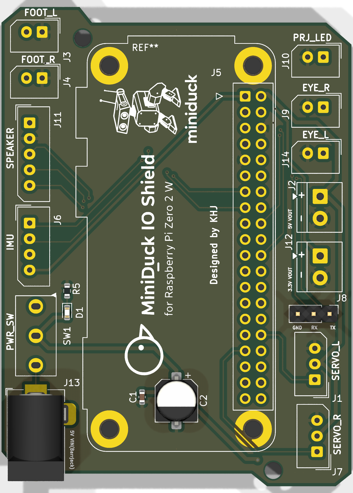
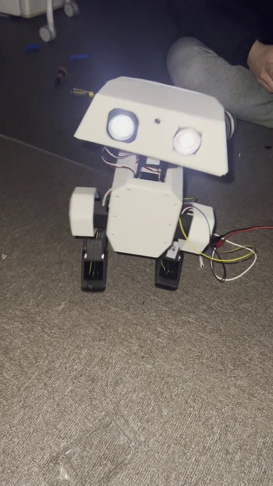
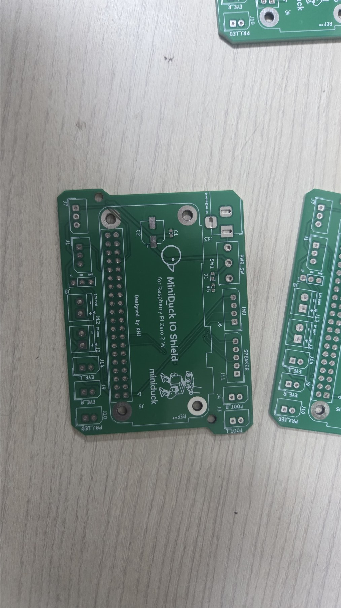
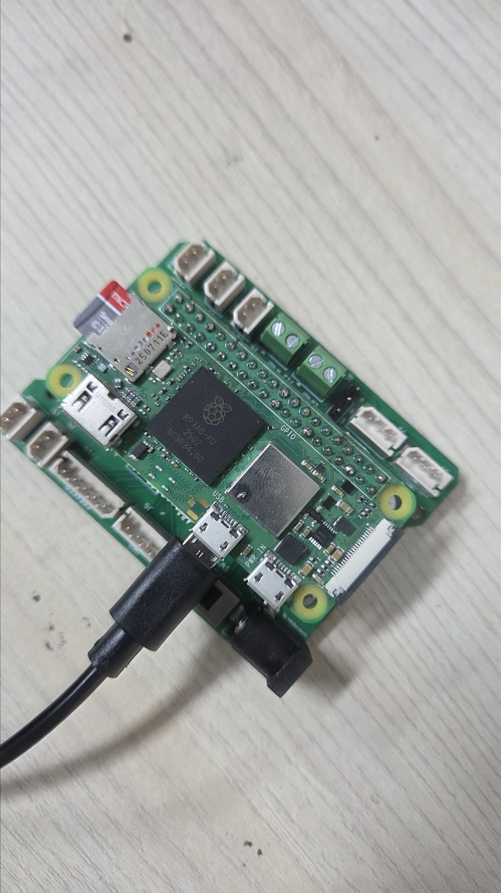
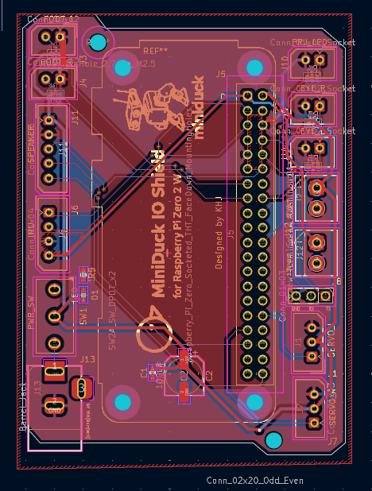
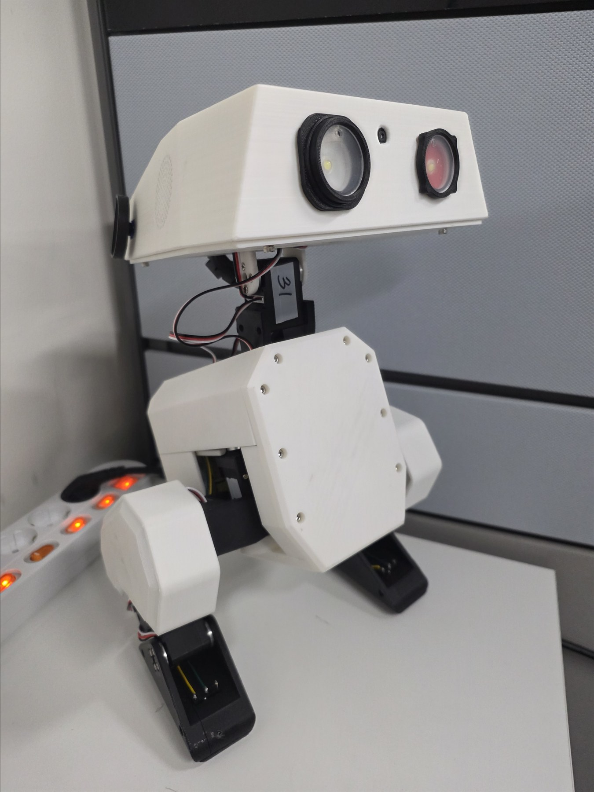

# MiniDuck IO Shield

A two-layer Raspberry Pi Zero 2 W shield that consolidates power distribution and the Open Duck Mini prototype's servo, foot-switch, IMU, speaker, UART, and LED connections.

This is a fork-specific community hardware addition, designed by KHJ and kept separate from the upstream Open Duck Mini design. The board has been fabricated, assembled with a Raspberry Pi Zero 2 W, and exercised on the robot prototype shown below.

The linked demonstration is a 46.9-second, 1080 x 1920 HEVC MP4. A [five-frame contact sheet](media/hardware-demo-contact-sheet.jpg) is also available for quick viewing.

## Board summary

| Item | Detail |
| --- | --- |
| Controller | Raspberry Pi Zero 2 W, 40-pin GPIO header |
| PCB | 2 layers, 1.6 mm nominal thickness |
| Outline | Approximately 56.0 x 76.5 mm bounding box |
| Input power | 5 V barrel-jack input through onboard slide switch |
| Power outputs | 5 V and 3.3 V screw-terminal breakouts |
| Robot I/O | 2 servo, 2 foot-switch, I2C IMU, I2S speaker, UART, and 3 LED outputs |
| Main connector families | 2.50 mm Molex SPOX, 3.50 mm screw terminals, 2.54 mm pin/IDC headers |
| Design tool | KiCad 9; outputs regenerated with KiCad 9.0.4 |
| Status | Fabricated and assembled prototype; see validation notes before reuse |

## Repository contents

| Path | Contents |
| --- | --- |
| [`kicad/`](kicad/) | Editable schematic, PCB, and project files |
| [`CONNECTORS.md`](CONNECTORS.md) | Connector pinout and Raspberry Pi GPIO mapping |
| [`docs/bom.csv`](docs/bom.csv) | BOM exported from the schematic |
| [`docs/schematic.pdf`](docs/schematic.pdf) | Single-page schematic for quick review |
| [`docs/drc-report.json`](docs/drc-report.json) | KiCad PCB rule-check report |
| [`docs/erc-report.json`](docs/erc-report.json) | KiCad schematic rule-check report |
| [`manufacturing/`](manufacturing/) | Prototype Gerbers, drill files, maps, and a vendor-upload ZIP |
| [`media/`](media/) | Renders, PCB/layout photos, assembly photos, robot photo, and demo video |

The original KiCad basename, `miniduc_shild`, is preserved so the project opens without disrupting its existing file relationships. Local KiCad state, caches, and automatic backups are intentionally excluded.

## Photos

| Fabricated board | Assembled shield |
| --- | --- |
|  |  |

| PCB layout | Robot prototype |
| --- | --- |
|  |  |

## Important prototype notes

- The three LED connector silkscreen labels do not match the electrical nets. Follow the actual-net mapping in [`CONNECTORS.md`](CONNECTORS.md), not the nearby label alone.
- KiCad reports no error-severity ERC/DRC items, but it does report warnings. The exact counts and categories are recorded in [`VALIDATION.md`](VALIDATION.md).
- R1 is a 10 kOhm resistor assigned to a `C_0603_1608Metric` library footprint. The land pattern is 0603-sized, but the library assignment should be corrected in a future revision.
- The custom slide-switch footprint name may not exist in another user's local library. Its placed footprint geometry is embedded in the PCB file.
- The manufacturing package is a reproducible snapshot of this fabricated prototype, not a claim that the design has passed an independent production review.

## Opening and regenerating

1. Open `kicad/miniduc_shild.kicad_pro` in KiCad 9.
2. Review the schematic and PCB against the intended wiring and connector orientation.
3. Run ERC and DRC locally and inspect every warning.
4. Regenerate Gerbers and drill files from the reviewed PCB before ordering a revised batch.

This folder follows the repository's root [Apache-2.0 license](../../LICENSE).

## 한국어 요약

이 폴더는 Raspberry Pi Zero 2 W 기반 Open Duck Mini용 I/O 실드보드 작업을 정리한 것입니다. KiCad 원본, 핀맵, BOM, 회로도 PDF, 시제품 제조 파일, 제작·조립 사진과 구동 영상을 포함합니다. 현재 파일은 실제 제작된 프로토타입 기록이며, LED 커넥터 실크 인쇄와 실제 GPIO 연결이 서로 다르므로 재사용하거나 재발주하기 전에 반드시 [`CONNECTORS.md`](CONNECTORS.md)와 [`VALIDATION.md`](VALIDATION.md)를 확인해야 합니다.
